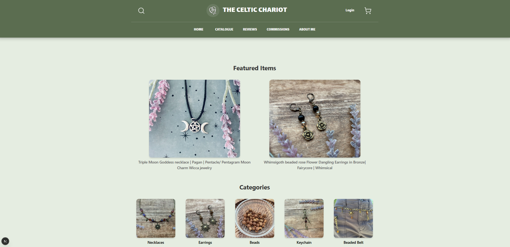
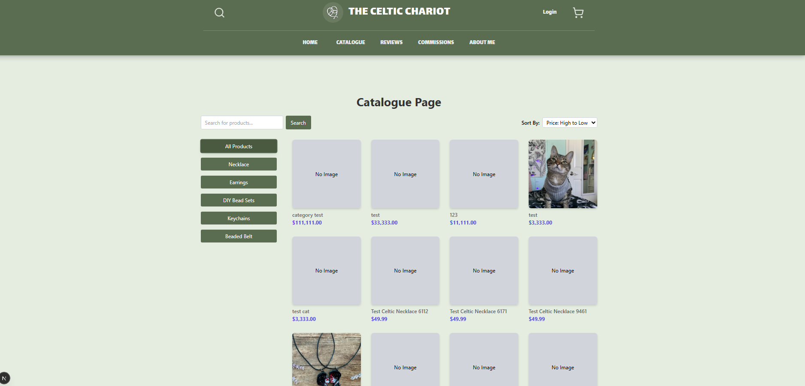
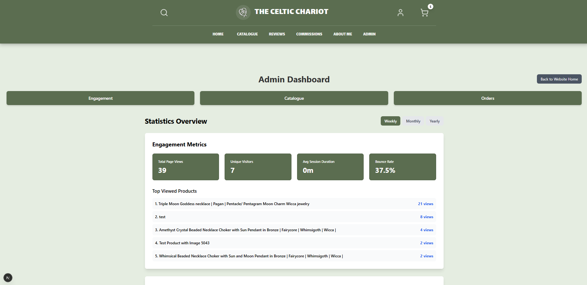
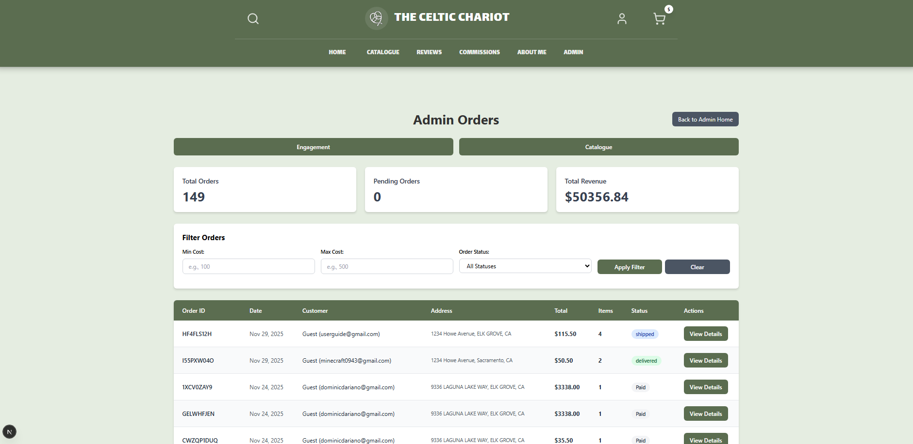
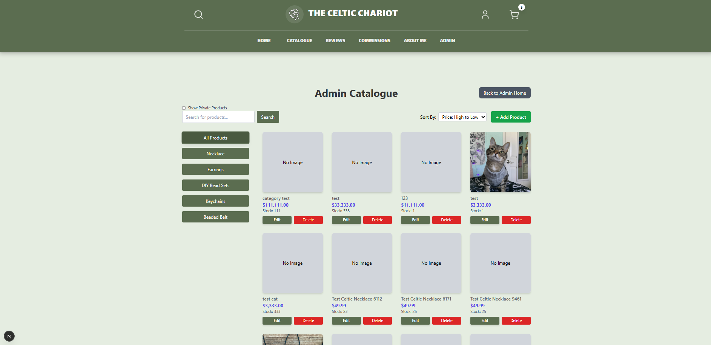
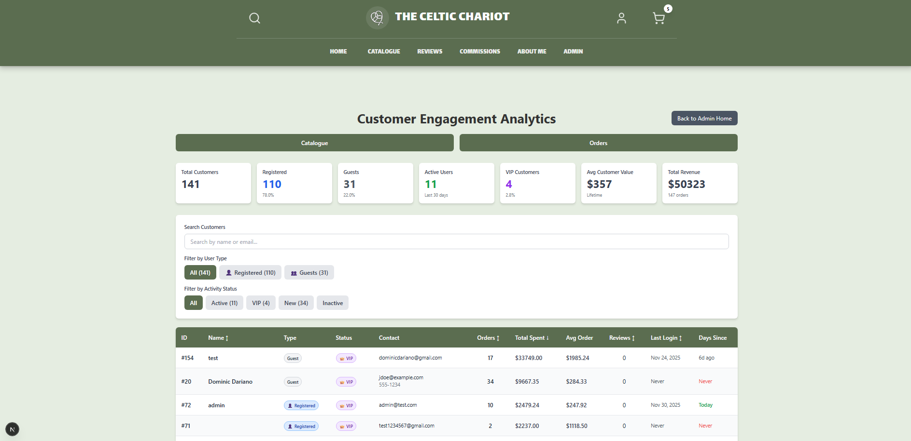
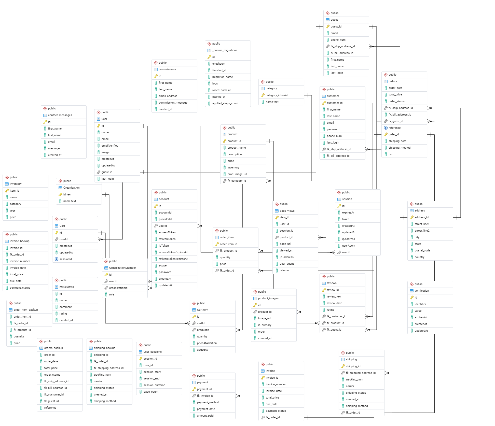

# 🛒 The Celtic Chariot


**A Modern E-Commerce Platform for Celtic Jewelry**

---

## 📖 About The Project

**The Celtic Chariot** is a full-stack e-commerce web application designed to empower independent jewelry sellers specializing in Celtic and alternative style pieces. The platform provides a complete online storefront solution, eliminating the need for third-party marketplace fees and restrictions.

### What The Application Does

The Celtic Chariot offers a comprehensive e-commerce experience with three main components:

1. **Customer Storefront**: A modern, responsive shopping interface where customers can:
   - Browse products with dynamic filtering and sorting by category, price, and popularity
   - View detailed product information with multiple images and customer reviews
   - Create accounts or checkout as guests for flexible shopping options
   - Complete secure purchases through Stripe payment integration
   - Track orders and view purchase history

2. **Admin Dashboard**: A powerful management interface that enables store owners to:
   - Monitor real-time sales and engagement analytics with customizable timeframes (weekly, monthly, yearly)
   - Manage product catalog with image uploads, inventory tracking, and category organization
   - Process orders with status updates and tracking number management
   - Track customer engagement including page views, session duration, and conversion rates
   - Identify VIP customers and analyze purchasing patterns

3. **Analytics & Tracking**: Built-in analytics system providing:
   - Real-time visitor tracking and session analysis
   - Product performance metrics and top seller identification
   - Customer behavior insights with bounce rate and session duration
   - Sales conversion tracking across different timeframes

### Why The Application Was Created

This website was developed as a senior team project to address the specific needs of our client, an independent jewelry seller who wanted to migrate from Etsy due to:
- High commission fees on marketplace platforms (15-20% typical)
- Limited control over branding and customer experience

By providing a self-hosted solution with complete ownership and control, The Celtic Chariot enables the client to independently build their brand, understand their customers, and maximize profits without third-party interference.

---

## 📸 Screenshots

### Customer Storefront

**Homepage**


*The main storefront displays featured products with filtering options, search functionality, and category navigation. Customers can browse the complete inventory with dynamic sorting capabilities.*

**Product Details Page**

*Detailed product view showing multiple images, price, inventory status, product description, customer reviews, and add-to-cart functionality.*

### Admin Dashboard

**Admin Dashboard - Home**

*Central admin hub displaying key metrics including sales statistics, engagement analytics, top products, and quick navigation to management sections. Features auto-refresh for real-time data updates every 30 seconds.*

**Order Management**

*Comprehensive order list with search, filtering by status, and detailed order views. Admins can update order status, add tracking numbers, and view complete customer and shipping information.*

**Product Catalog Management**

*Product management interface with add/edit/delete capabilities, image upload to Vercel Blob storage, inventory tracking, category assignment, and private/public visibility controls.*

**Customer Engagement Analytics**

*Customer relationship management showing all customers with VIP status indicators, purchase history, engagement metrics, and filtering by activity status (Active, Inactive, VIP, New).*

---

## 👥 Team Members

**Team Name:** [Code_Breakers]

| Name | Role | Contact |
|------|------|---------|
| [Dominic Dariano] | [ddariano@csus.edu] |
| [Paul DeCosta] | [pdecosta@csus.edu] |
| [Tyson Huynh] | [tysonhuynh@csus.edu] |
| [Justin Mariano] | [jqmariano@csus.edu] |
| [Yohannes Teklemariam] | [ateklemariam@csus.edu] |

---

## 🧰 Tech Stack

### Frontend
- **Next.js 14** - React framework with App Router for server-side rendering and routing
- **React 18** - Component-based UI library
- **TypeScript** - Type-safe JavaScript for better development experience
- **Tailwind CSS** - Utility-first CSS framework for responsive design

### Backend
- **Next.js API Routes** - Serverless functions for backend logic
- **Prisma ORM** - Type-safe database queries and migrations
- **PostgreSQL** - Relational database for data persistence
- **Better-Auth** - Modern authentication with Google OAuth integration

### Third-Party Services
- **Stripe** - Payment processing and checkout (API version 2025-09-30.clover)
- **Vercel Blob** - Image storage for product photos
- **Neon** - Serverless PostgreSQL database hosting (us-west-2 region)
- **Vercel** - Platform for hosting and continuous deployment

### Development Tools
- **Prisma Studio** - Database GUI for development
- **Git** - Version control

---

## 🗄️ Database Schema

### Entity Relationship Diagram (ERD)


### Key Tables
- **product** - Product catalog with pricing, inventory, and category relationships
- **orders** - Order records with UUID primary keys and unique reference numbers
- **order_item** - Line items for each order
- **guest** - Customer information (can be linked to registered users)
- **user** - Registered user accounts with Better-Auth integration
- **OrganizationMember** - Role-based access control (ADMIN/CUSTOMER)
- **page_views** - Analytics tracking for visitor behavior
- **user_sessions** - Session tracking for engagement metrics
- **Cart & CartItem** - Shopping cart system supporting both authenticated and guest users
- **shipping** - Shipping tracking and carrier information
- **invoice & payment** - Financial transaction records

---

## 🧪 Testing

### Manual Testing

The application has been thoroughly tested through manual testing procedures covering all major functionality:

**Customer Features:**
1. Browse products and use filtering/sorting
2. Add items to cart (as guest and registered user)
3. Complete checkout with test Stripe cards
4. Create account and login (email/password and Google OAuth)
5. View order history and track orders

**Admin Features:**
1. Access admin dashboard (requires ADMIN role)
2. View real-time statistics and analytics
3. Manage products (create, edit, delete/hide)
4. Process orders (update status, add tracking)
5. View customer engagement data

### Automated Testing

**Admin Dashboard Selenium Tests:**
Comprehensive test suite covering all admin pages with 200+ individual test cases.

To run automated tests:
```bash
# Install testing dependencies
npm install
pip install selenium==4.38.0

# Run a test
# Navigate to ‘/Testing’ folder and open the test you want to run 
# Run the ‘test-start.bat’ script 
# When test is complete, make sure to close server and/or webhook processes 

```

**Test Coverage:**
- Admin authentication and authorization
- Statistics API endpoints (sales and engagement)
- Product CRUD operations
- Order management workflows
- Analytics tracking functionality

---

## 🚀 Getting Started

### Prerequisites

Before you begin, ensure you have the following installed:
- **Node.js** v18 or higher ([Download here](https://nodejs.org/en/download))
- **npm** (comes with Node.js)
- **Git** for version control
- **PostgreSQL** (optional for local development - can use Neon cloud database)

### Installation & Setup

#### 1. Verify Node.js Installation
```bash
# Check Node.js version
node -v
# Should output v18.x.x or higher

# Check npm version
npm -v
```

#### 2. Clone the Repository
```bash
git clone https://github.com/Hail808/TheCelticChariot.git
cd TheCelticChariot
```

#### 3. Install Dependencies
```bash
npm install
```

#### 4. Environment Configuration

Create environment files in the root directory:

**Create `.env` file:**
```env
# Database Connection (Neon PostgreSQL)
DATABASE_URL="postgresql://[username]:[password]@[host]/thecelticchariot?sslmode=require"
DIRECT_URL="postgresql://[username]:[password]@[host]/thecelticchariot?sslmode=require"

# Node Environment
NODE_ENV="development"
```

**Create `.env.local` file:**
```env
# Authentication
BETTER_AUTH_SECRET="your-secret-key-here"  # Generate with: openssl rand -base64 32
BETTER_AUTH_URL="http://localhost:3000"

# Google OAuth (Optional - get from Google Cloud Console)
GOOGLE_CLIENT_ID="your-google-client-id"
GOOGLE_CLIENT_SECRET="your-google-client-secret"

# Stripe Payment Integration
STRIPE_SECRET_KEY="sk_test_your_stripe_test_key"
STRIPE_WEBHOOK_SECRET="whsec_your_webhook_secret"
GROUND_SHIPPING_RATE_ID="shr_your_ground_rate_id"
PRIORITY_SHIPPING_RATE_ID="shr_your_priority_rate_id"

# Vercel Blob Storage (for product images)
BLOB_READ_WRITE_TOKEN="vercel_blob_rw_your_token"

# Application URL
NEXT_PUBLIC_BASE_URL="http://localhost:3000"
```

**How to Get API Keys:**

*Neon Database:*
1. Sign up at [console.neon.tech](https://console.neon.tech)
2. Create a new project
3. Copy the connection string to `DATABASE_URL` and `DIRECT_URL`

*Stripe:*
1. Sign up at [stripe.com](https://stripe.com)
2. Get test API keys from the Dashboard
3. Create shipping rates in Products section
4. Set up webhook endpoint for `/api/webhooks/stripe`

*Google OAuth (Optional):*
1. Go to [Google Cloud Console](https://console.cloud.google.com)
2. Create a new project
3. Enable Google+ API
4. Create OAuth 2.0 credentials
5. Add `http://localhost:3000/api/auth/callback/google` to authorized redirect URIs

*Vercel Blob:*
1. Sign up at [vercel.com](https://vercel.com)
2. Create a Blob store in your project settings
3. Copy the read/write token

#### 5. Database Setup

```bash
# Generate Prisma Client
npx prisma generate

# Push database schema (creates tables)
npx prisma db push

# (Optional) Open Prisma Studio to view database
npx prisma studio
```

#### 6. Create Admin User

After setting up the database, you need to create an admin user:

```bash
# Start the development server
npm run dev

# In your browser, go to http://localhost:3000
# Sign up for an account

# Then, connect to your database and run:
# (You can use Prisma Studio or psql)
```

```sql
-- Find your user ID
SELECT id, email FROM "user" WHERE email = 'your-email@example.com';

-- Update role to ADMIN
UPDATE "OrganizationMember" 
SET role = 'ADMIN' 
WHERE "userId" = 'your-user-id-from-above';

-- Verify
SELECT u.email, om.role 
FROM "user" u
JOIN "OrganizationMember" om ON u.id = om."userId"
WHERE u.email = 'your-email@example.com';
```

#### 7. Run the Development Server

```bash
npm run dev
```

Open [http://localhost:3000](http://localhost:3000) in your browser to see the application.

**Access Points:**
- **Storefront**: `http://localhost:3000`
- **Admin Dashboard**: `http://localhost:3000/admin` (requires ADMIN role)
- **API Endpoints**: `http://localhost:3000/api/*`

---

## 📦 Deployment

### Deploying to Vercel (Production)

#### 1. Prepare for Deployment

```bash
# Ensure all changes are committed
git add .
git commit -m "Prepare for deployment"
git push origin main
```

#### 2. Deploy to Vercel

**Option A: Via Vercel Dashboard**
1. Sign up at [vercel.com](https://vercel.com)
2. Click "Add New Project"
3. Import your GitHub repository
4. Configure project:
   - Framework Preset: Next.js
   - Build Command: `npm run build`
   - Output Directory: `.next`
   - Install Command: `npm install`

**Option B: Via Vercel CLI**
```bash
# Install Vercel CLI
npm install -g vercel

# Login to Vercel
vercel login

# Deploy
vercel --prod
```

#### 3. Set Environment Variables in Vercel

Go to your project settings in Vercel Dashboard → Environment Variables and add all variables from `.env` and `.env.local`:

**Important:** Update these for production:
- `BETTER_AUTH_URL` → Your production domain (e.g., `https://your-app.vercel.app`)
- `NEXT_PUBLIC_BASE_URL` → Your production domain
- `STRIPE_SECRET_KEY` → Use live key instead of test key (starts with `sk_live_`)
- Google OAuth redirect URIs → Add production callback URL

#### 4. Configure Database

Your Neon database works for both development and production. No changes needed unless you want separate databases.

#### 5. Run Database Migrations

```bash
# From your local machine, push schema to production database
npx prisma migrate deploy
```

#### 6. Verify Deployment

1. Visit your production URL
2. Test customer checkout flow
3. Login to admin dashboard at `/admin`
4. Verify all features work correctly

#### 7. Monitor Deployment

- View logs: Vercel Dashboard → Your Project → Deployments → Logs
- Check function performance: Vercel Dashboard → Analytics
- Monitor errors: Set up error tracking (optional)

### Continuous Deployment

Vercel automatically deploys when you push to your main branch:

```bash
# Make changes
git add .
git commit -m "Your changes"
git push origin main

# Vercel automatically builds and deploys
# Check deployment status in Vercel dashboard
```

---

## 📝 Project Structure

```
TheCelticChariot/
├── src/
│   ├── app/                      # Next.js App Router
│   │   ├── admin/               # Admin dashboard pages
│   │   │   ├── page.tsx         # Dashboard home
│   │   │   ├── orders/          # Order management
│   │   │   ├── catalogue/       # Product management
│   │   │   └── engagement/      # Customer analytics
│   │   ├── api/                 # API routes (serverless functions)
│   │   │   ├── admin/           # Admin statistics endpoints
│   │   │   ├── analytics/       # Tracking endpoints
│   │   │   ├── products/        # Product CRUD
│   │   │   ├── orders/          # Order management
│   │   │   └── auth/            # Authentication endpoints
│   │   └── ...                  # Other pages
│   ├── components/              # React components
│   │   ├── pages/               # Page-level components
│   │   └── ...                  # Shared components
│   └── lib/                     # Utility libraries
│       ├── auth.ts              # Better-Auth configuration
│       ├── db.ts                # Database connection pool
│       ├── prisma.ts            # Prisma client
│       ├── analytics.ts         # Analytics tracking
│       └── cart-service.ts      # Shopping cart logic
├── prisma/
│   └── schema.prisma            # Database schema
├── public/                      # Static assets
├── .env                         # Database environment variables
├── .env.local                   # API keys and secrets (not committed)
├── package.json                 # Dependencies
└── README.md                    # This file
```

---

## 🔒 Security Notes

- Never commit `.env` or `.env.local` files to Git
- Keep API keys and secrets secure
- Use Stripe test mode for development
- Regularly update dependencies: `npm update`
- Use strong passwords for admin accounts

---

## 📄 License

This project is developed as a senior team project for California State University, Sacramento.

---

