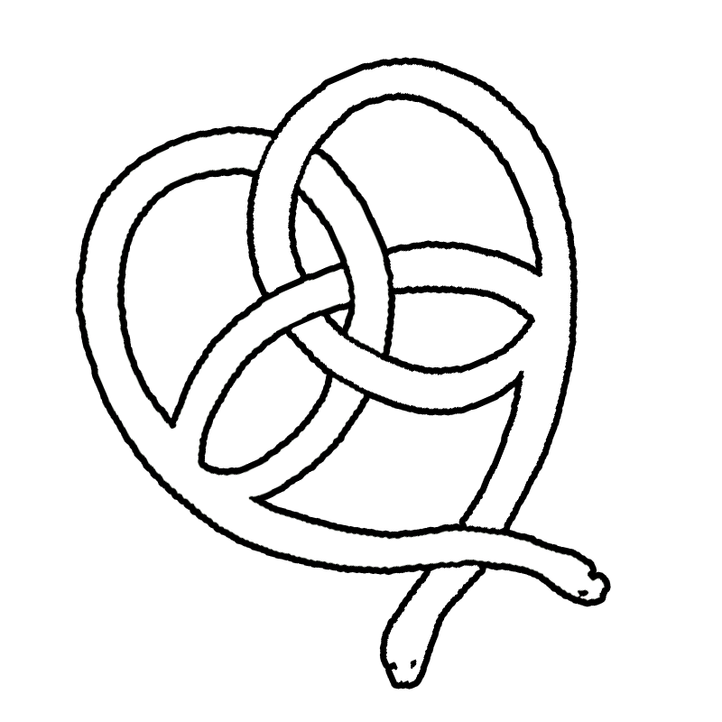

# 🛒 The Celtic Chariot



**The Celtic Chariot** is a full-stack e-commerce web application built to empower independent jewelry sellers. Designed for alternative style pieces, the platform allows our client to manage their own storefront, free from third-party platforms.

---

## ✨ Features

- 🛍️ Product catalog with dynamic filtering and sorting
- 🔐 User authentication with **NextAuth.js**
- 💳 Secure checkout powered by **Stripe**
- ✉️ Order and notification emails via **Resend**
- 📦 Admin dashboard for managing inventory and orders
- 📈 Scalable backend using **NestJS** and **PostgreSQL**
- 🚀 Deployed on **Vercel** for modern CI/CD

---

## 🧰 Tech Stack

- **Frontend**: Next.js, React, Tailwind CSS
- **Backend**: NestJS (Node.js)
- **Database**: PostgreSQL (hosted or local)
- **Auth**: NextAuth.js
- **Payments**: Stripe
- **Email**: Resend
- **Deployment**: Vercel

---

## Testing

## Deployment

## Dev Instructions

---

## Timeline

- Milestone 1: Backend (Nest.js) setup and connection to Frontend (Next.js)
- Milestone 2: Database initialization (PostgreSQL) 
- Milestone 3: Server Host setup (Vercel)
- Milestone 4: Payment Implementation (Stripe)
- Milestone 5: Login and Security Handling (NextAuth.js)

---

## ⚙️ Getting Started

### Prerequisites

- Node.js v18+
- PostgreSQL
- Stripe + Resend API keys
- Vercel account (optional, for deployment)

### Install latest Node JS
https://nodejs.org/en/download
### use Setup Wizard to install to desired location

### Installation

```bash
# Assure instalation and version
node -v

# Clone the repository
git clone https://github.com/Hail808/TheCelticChariot.git
cd TheCelticChariot

# Install dependencies
npm install

# Start the app
npm run dev

```

# Should open Prototype Homepage
